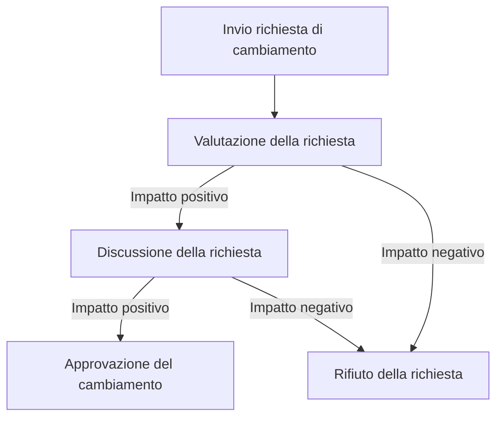

# Launching e Execution

Definiti gli obiettivi, requisiti e le attività necessarie, il team è pronto
per passare alla fase di lancio ed esecuzione del progetto. In questa fase, il team
si concentra sull'implementazione delle attività pianificate.

## Kick-off

Durante il kick-off, il team si riunisce per presentare e avviare ufficialmente il
progetto. Questo incontro è fondamentale per allineare tutti su quanto analizzato
e pianificato nelle fasi precedenti. Il Product Owner e il Project Manager
illustrano ai membri del team le milestone del progetto, l'approccio SCRUM, le
pratiche di lavoro adottate e i deliverable attesi. L'incontro si conclude con la
definizione delle regole operative del team e con una sessione di Q&A per rispondere
a eventuali dubbi o domande.

## Matrice di assegnazione delle responsabilità (RASCI)

Si è deciso di utilizzare la matrice RASCI per definire le responsabilità e i ruoli
di ciascun membro del team nelle attività principali del progetto. La matrice RASCI
è definita come segue:

- **R**: Responsabile - Colui che esegue l'attività e del suo completamento
- **A**: Accountable - Colui che approva il risultato finale dell'attività
- **S**: Support - Colui che supporta il responsabile
- **C**: Consulted - Colui che assiste il responsabile
- **I**: Informed - Colui che deve essere informato sui progressi dell'attività

| Attività             | Manuel Buizo | Luana Mennuti | Alessandro Ricci | Matteo Manicone | Sabatino Panella | Dominic Sambucco |
|----------------------|--------------|---------------|------------------|-----------------|------------------|------------------|
| Prototipazione       | R            | A             | C                | I               | I                | I                |
| Narrativa            | I            | R             | C                | S               | C                | I                |
| Meccaniche Roguelite | S            | C             | R                | I               | I                | I                |
| Meccaniche Action    | R            | S             | C                | I               | I                | I                |
| Meccaniche RPG       | C            | R             | C                | S               | I                | I                |
| UI                   | I            | R             | S                | S               | C                | I                |
| Marketing            | C            | S             | I                | R               | I                | I                |
| Finalizzazione       | S            | C             | I                | R               | I                | I                |

## Regole operative per il team

Si sono stabilite le seguenti regole operative per il team:

- **Problem solving**: il team adotterà un approccio collaborativo per risolvere i problemi, discutendo
  le soluzioni e cercando il consenso.
- **Decision making**: le decisioni saranno prese in modo condiviso, valutando le opzioni e cercando
  il consenso tra i membri del team.
- **Conflict resolution**: in caso di conflitti, il team adotterà un approccio costruttivo, cercando
  di risolvere le divergenze attraverso il dialogo e la mediazione.
- **Brainstorming**: il team utilizzerà sessioni di brainstorming per generare idee e soluzioni
  creative, incoraggiando la partecipazione attiva di tutti i membri.
- **Team meetings**: le riunioni del team saranno programmate regolarmente per discutere i progressi,
  risolvere problemi e pianificare le attività future. Saranno utilizzati strumenti di collaborazione
  come Teams e YouTrack per facilitare la comunicazione e la gestione delle attività.

Per ogni attività, il team dovrà aggiornare lo stato su YouTrack, in modo da mantenere traccia
dei progressi e delle attività completate. In questo modo, ogni possibile cambiamento o
l’insorgere di eventuali problematiche potrà essere gestito in modo efficace e tempestivo.

### Tool

- **Unity**: per lo sviluppo del gioco, con supporto a C# e strumenti di prototipazione
- **Rider**: per lo sviluppo del gioco, con supporto a Unity e C#
- **Git**: per il versionamento del codice, collaborazione tra i membri del team e CI/CD.
- **GitHub**: per la gestione del repository, pull request e modello di branching.
- **Teams**: per la comunicazione in tempo reale e la condivisione di informazioni.
- **YouTrack**: per la gestione delle attività, issue tracking, pianificazione del progetto e generazione di report.
- **Figma**: per la prototipazione e la creazione di wireframe.
- **Miro**: per la creazione di diagrammi e la visualizzazione delle idee.

### Problem solving

Per la risoluzione dei problemi, il team seguirà l'approccio proposto da Daniel Couger,
che prevede i seguenti passaggi:

1. **Identificazione del problema**: comprendere la natura del problema e le sue cause.
2. **Brainstorming**: per generare idee e soluzioni possibili.
3. **Scelta della soluzione**: selezionare la soluzione più adatta in base ai criteri stabiliti.
4. **Implementazione della soluzione**: mettere in pratica la soluzione scelta.
5. **Revisione dei risultati**: valutare l'efficacia della soluzione implementata e apportare eventuali
   modifiche necessarie.

Per rendere efficente il processo di problem solving, parteciperanno
solo i membri del team che hanno competenze specifiche o che sono
direttamente interessati al problema. Questo approccio consente di
coinvolgere in modo mirato i membri del team, garantendo una maggiore
efficacia e coinvolgimento nella risoluzione del problema.

### Decision making

Per il processo decisionale, il team adotterà un approccio **participative/collaborative**
di un sottoinsieme di membri del team, in cui le decisioni vengono prese
attraverso il consenso e la discussione. Questo approccio consente di coinvolgere
in modo mirato i membri del team che hanno competenze specifiche o che sono
direttamente interessati alla decisione, garantendo una maggiore efficacia e
coinvolgimento.

Le decisioni saranno documentate e comunicate a tutti i membri del team
per garantire trasparenza e chiarezza.

### Conflict resolution

Per la risoluzione dei conflitti, il team adotterà un approccio costruttivo e
collaborativo, cercando di risolvere le divergenze attraverso il dialogo e la mediazione.

Il processo prevede i seguenti passaggi:

1. **Identificazione del conflitto**: comprendere la natura del conflitto e le posizioni delle parti coinvolte.
2. **Ascolto attivo**: ascoltare le posizioni e le preoccupazioni di tutte le parti coinvolte.
3. **Discussione delle soluzioni**: discutere le possibili soluzioni e cercare un consenso.
4. **Accordo sulla soluzione**: raggiungere un accordo sulla soluzione da adottare.

Qualora il conflitto non possa essere risolto internamente, la risoluzione sarà
affidata al Project Manager, che agirà come mediatore per facilitare il dialogo
e trovare una soluzione condivisa.

### BrainStorming

Le sessioni di brainstorming saranno utilizzate per generare idee e soluzioni
creative. Durante queste sessioni, tutti i membri del team sono incoraggiati a
partecipare attivamente (sessione innescata da un sotto-insieme del team),
condividendo le proprie idee senza timore di critiche.
Le idee saranno raccolte e valutate in un secondo momento, per identificare
quelle più promettenti e svilupparle ulteriormente.

Questo approccio favorisce la creatività e l'innovazione, consentendo a tutti
i membri del team di contribuire con le proprie competenze e prospettive,
senza limitazioni o pregiudizi.

### Team Meetings

Le riunioni del team saranno programmate regolarmente per discutere i progressi,
risolvere problemi e pianificare le attività future. Durante queste riunioni,
saranno utilizzati strumenti di collaborazione come Teams e YouTrack per facilitare
la comunicazione e la gestione delle attività.

| Tipo di riunione | Frequenza                    | Partecipanti            | Durata (minuti) | Obiettivo                                                                |
|------------------|------------------------------|-------------------------|-----------------|--------------------------------------------------------------------------|
| Daily Standup    | Giornaliera                  | Tutti i membri del team | 20m             | Aggiornamento sui progressi e pianificazione delle attività del giorno   |
| Sprint Review    | Al termine dello sprint      | Tutti i membri del team | 30m             | Revisione dei risultati dello sprint e feedback                          |
| Sprint Planning  | Ogni 2 settimane             | Tutti i membri del team | 60m             | Pianificazione delle attività per il prossimo sprint                     |
| Milestone Review | Al termine di ogni milestone | Tutti i membri del team | 60m             | Revisione dei risultati raggiunti e pianificazione delle attività future |
| Decision Making  | Quando necessario            | Sottoinsieme del team   | Variabile       | Discussione e presa di decisioni su questioni specifiche                 |
| Problem Solving  | Quando necessario            | Sottoinsieme del team   | Variabile       | Risoluzione di problemi specifici e discussione delle soluzioni          |
| Help meeting     | Quando necessario            | Sottoinsieme del team   | Variabile       | Richiesta di supporto da parte di un membro del team                     |

Gli help meeting sono innescati da un membro del team che ha bisogno di
supporto su un'attività specifica. Durante questi incontri, il membro del team
presenta il problema a un sottoinsieme del team, che fornisce supporto e
consigli per risolvere la questione. Questi incontri sono utili per condividere
conoscenze e competenze, garantendo che tutti i membri del team possano
contribuire al successo del progetto.

## Gestione dei cambiamenti di scope

Per la gestione dei cambiamenti di scope, il team adotterà un approccio
formale e strutturato, seguendo le seguenti fasi:

1. **Invio della richiesta di cambiamento**: qualsiasi membro del team può
   inviare una richiesta di cambiamento tramite YouTrack, specificando:
    - Descrizione del cambiamento richiesto
    - Descrizione del problema o dell'opportunità
    - Impatto previsto sul progetto (positivo e negativo)
    - Attività o deliverable interessati
    - Risorse necessarie per implementare il cambiamento
2. **Valutazione della richiesta**: il Project Manager, Product Owner e i membri
   del team interessati valuteranno se prendere in considerazione la
   richiesta di cambiamento.
3. **Discussione**: una volta considerata la richiesta di cambiamento
   sarà discussa per la sua approvazione durante una riunione di decision making,
   in cui si valuteranno l'impatto sul progetto, le risorse necessarie e i rischi associati.
4. **Approvazione**: se la richiesta di cambiamento viene approvata, il team procederà
   con l'implementazione del cambiamento e aggiornerà la documentazione del progetto.
5. **Rifiuto**: se la richiesta di cambiamento viene rifiutata

## Gestione delle comunicazioni

Per la gestione delle comunicazioni, il team utilizzerà diversi strumenti e canali
per garantire una comunicazione efficace e tempestiva tra i membri del team.
Gli strumenti principali includono:

- **Teams**: per la comunicazione in tempo reale, condivisione di file e discussioni
- **YouTrack**: per la gestione delle attività, issue tracking e pianificazione del progetto
- **GitHub**: per la gestione del repository, issue tracking e pull request

Le comunicazioni saranno condivise in modo trasparente e accessibile a tutti i
membri del team, per garantire che tutti siano informati sui progressi, le decisioni
e le attività in corso. Inoltre ogni comunicazione sarà direttamente inserita in
YouTrack, in modo da garantire la tracciabilità e la documentazione delle attività
del progetto.

## Work Package

Per la gestione delle attività, il team utilizzerà **YouTrack** come work package,
dove ogni attività sarà rappresentata da un ticket. I ticket saranno utilizzati
per tracciare lo stato delle attività, assegnare responsabilità e monitorare i progressi.
Ogni ticket conterrà le seguenti informazioni:

- **Titolo**: breve descrizione dell'attività
- **Descrizione**: dettagli sull'attività, inclusi obiettivi e requisiti
- **Assegnatario**: membro del team responsabile dell'attività
- **Stato**: stato attuale dell'attività (ad esempio, "In corso", "Completato", "In attesa")
- **Priorità**: livello di priorità dell'attività (ad esempio, "Alta", "Media", "Bassa")
- **Etichette**: tag per categorizzare l'attività (ad esempio, "Prototipazione", "Narrativa", "Roguelite")
- **Commenti**: per discussioni e aggiornamenti sull'attività
- **Date**: date di inizio e fine previste per l'attività, con successiva data di fine effettiva

Questa struttura consentirà di generare report (gantt, burn-down, velocità del team)
e statistiche sulle attività del progetto, monitorare i progressi e identificare
eventuali problemi o ritardi. Inoltre, ogni attività sarà collegata alle milestone
del progetto, per garantire che tutte le attività necessarie per raggiungere gli
obiettivi del progetto siano completate in tempo.

