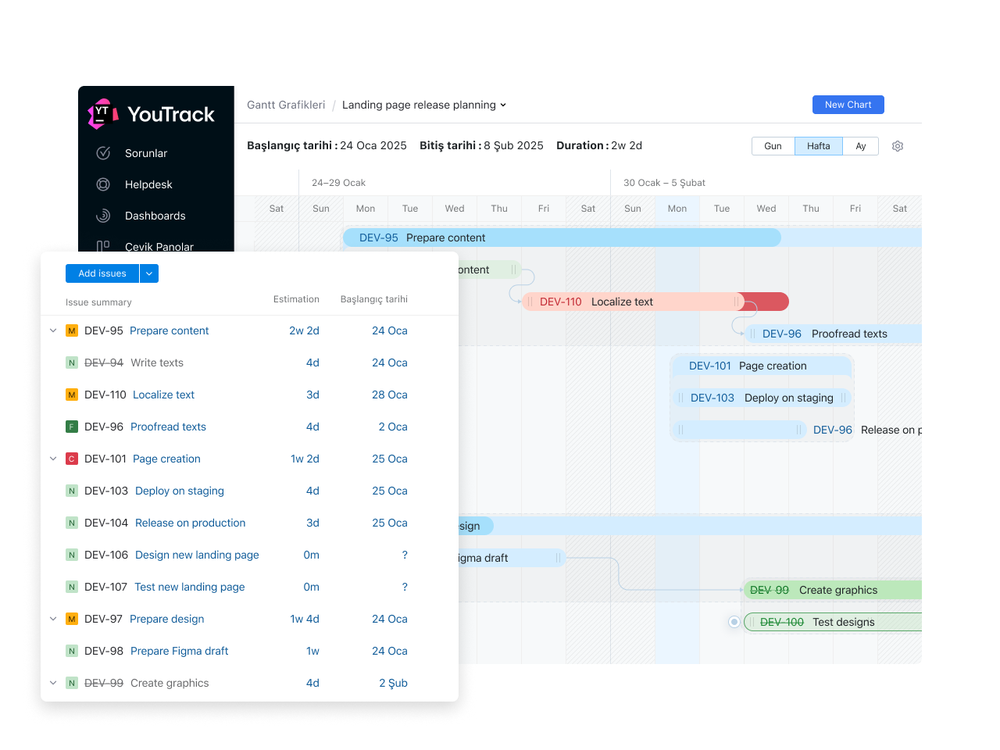

# Monitoring and Controlling

Lo scopo di questa fase è monitorare e controllare lo stato del progetto,
assicurandosi che sia in linea con gli obiettivi prefissati e che le risorse
vengano utilizzate in modo efficiente. In questa fase si forniscono
aggiornamenti regolari sull’andamento del progetto e si abilita una gestione
proattiva delle eventuali criticità.

## Sistema di reporting

Come sistema di reporting si è scelto di utilizzare la tecnologia di
**YouTrack** per la gestione dei task e delle issue del progetto.
Inoltre lo stesso strumento permette di creare report (raccolta dati automatici)
e dashboard personalizzati per monitorare lo stato del progetto.

In questo modo si riescono a coprire le seguenti tipologie di report:

- current period report: report periodici che mostrano lo stato attuale del progetto
- cumulative report: report che mostrano lo stato del progetto dall'inizio
- exception report: report che mostrano le eccezioni o le criticità del progetto
- stoplight report: report che mostrano lo stato del progetto in modo visivo,
  evidenziando le aree critiche
- variance report: report che mostrano le differenze tra lo stato attuale e quello pianificato del progetto

Per riuscire a coprire tutte le tipologie di report, YouTrack permette di
creare i seguenti tipi di report:

| **Tipologia di Report** | **Diagramma / Report in YouTrack**              | **Descrizione**                                                                                                                                                  |
|-------------------------|-------------------------------------------------|------------------------------------------------------------------------------------------------------------------------------------------------------------------|
| **Current Period**      | **Time Report (by period)**                     | Mostra il tempo registrato per ogni utente, attività o progetto in un intervallo di tempo specifico (es. settimana corrente). Utile per analisi di produttività. |
|                         | **Burndown Chart**                              | Visualizza la quantità di lavoro rimanente nel tempo. Ideale per sprint o milestone, mostra se si è nei tempi.                                                   |
|                         | **Activity Stream**                             | Elenco cronologico delle modifiche recenti a task e progetti nel periodo selezionato.                                                                            |
| **Cumulative**          | **Cumulative Flow Diagram (CFD)**               | Mostra la quantità di issue in ogni stato (es. “In corso”, “Completato”) nel tempo. Utile per rilevare colli di bottiglia.                                       |
|                         | **Created vs Resolved Chart**                   | Confronta il numero di task creati e risolti nel tempo. Permette di capire se il carico di lavoro sta aumentando o diminuendo.                                   |
| **Exception**           | **Issue Distribution Report (con filtri)**      | Evidenzia issue fuori standard: es. in ritardo, bloccanti, critici. Si possono filtrare per priorità, scadenza o assegnatario.                                   |
|                         | **Custom Saved Searches (Dashboard)**           | Ricerca personalizzata di issue anomale (es. scadute, riaperte più volte). I risultati possono essere mostrati su dashboard.                                     |
|                         | **Pie/Bar Chart per tipo di eccezione**         | Visualizza la distribuzione degli issue per categoria critica (es. bug bloccanti, task senza assegnatario).                                                      |
| **Stoplight**           | **Gantt Chart (con colori custom)**             | Visualizza le attività e il loro stato con codifica a colori (verde/giallo/rosso). Serve a indicare il livello di rischio.                                       |
|                         | **Progress Summary Widget**                     | Mostra l’avanzamento complessivo del progetto o dei task con indicatori visivi (percentuali, colori).                                                            |
|                         | **Custom Status Chart (es. On Track, At Risk)** | Rappresenta lo stato di avanzamento per task/progetto usando categorie definite e colori (es. semaforo).                                                         |
| **Variance**            | **Time Report (Estimated vs Actual)**           | Confronta il tempo stimato e il tempo effettivamente registrato. Evidenzia scostamenti e inefficienze.                                                           |
|                         | **Gantt Chart (con date pianificate vs reali)** | Mostra la differenza tra le date inizialmente previste e quelle effettive. Utile per controllo avanzamento.                                                      |
|                         | **Custom Field Math (in Dashboard)**            | Permette (tramite campi personalizzati) di visualizzare delta fra stime e consuntivi. Spesso usato con tabelle o grafici.                                        |

Di seguito è riportato un esempio di gantt chart:

## Scope Bank

Lo scope bank è un elenco di funzionalità e requisiti che non sono stati inclusi
nello scope iniziale del progetto, ma che potrebbero essere implementati in
futuro se le risorse lo permettono. Serve a gestire le richieste di
cambiamento e a garantire che il progetto rimanga focalizzato sugli obiettivi
iniziali.
Lo scope bank viene aggiornato regolarmente con l'ottica di poter aggiungere
funzionalità extra al progetto, se le risorse lo permettono.

E grazie alla raccolta strutturata delle informazioni, si riesce a gestire
lo scope bank in modo efficiente, evitando di perdere di vista le richieste
di cambiamento e le funzionalità extra che potrebbero essere implementate in
futuro.

## Costruire e mantenere l'issues log

L'issues log è un registro delle problematiche e delle criticità del progetto.
Serve a tenere traccia delle questioni aperte, delle decisioni prese e delle
azioni da intraprendere per risolverle.
Le issue vengono registrate in YouTrack e gestite attraverso un processo
strutturato che prevede la loro assegnazione a un responsabile, la definizione
di una scadenza e la registrazione delle azioni intraprese per risolverle
e il loro stato attuale.

Ogni issue verrà creata con le seguenti informazioni:

- **ID**: identificativo univoco dell'issue
- **Titolo**: breve descrizione dell'issue
- **Descrizione**: descrizione dettagliata dell'issue
- **Descrizione dell'impatto**: descrizione dell'impatto dell'issue sul progetto
- **Priorità**: livello di priorità dell'issue (alta, media, bassa)
- **Stato**: stato attuale dell'issue (aperta, in corso, risolta, chiusa)
- **Assegnatario**: persona responsabile della risoluzione dell'issue
- **Date**: data di creazione dell'issue, data di scadenza e data di risoluzione
- **Commenti**: commenti e aggiornamenti sull'issue
- **Azioni intraprese**: azioni intraprese per risolvere l'issue

Inoltre ogni issue apre un branch di sviluppo dedicato, in modo da poter
gestire le modifiche in modo isolato e garantire che il codice sia sempre
funzionante. Una volta risolta l'issue, il branch viene unito al branch
principale tramite una pull request, che viene revisionata e approvata
prima di essere unita, chiudendo così l'issue su YouTrack.

## Gestire i project status meetings

Durante lo sviluppo del progetto si svolgono diversi meeting per monitorare
lo stato di avanzamento e discutere eventuali criticità. Tali incontri
devono produrre come risultato l’aggiornamento dello stato del progetto
(task, problemi, difficoltà, idee, ecc.), attraverso la registrazione puntuale
delle informazioni su YouTrack. In questo modo vengono mantenuti aggiornati
lo scope bank, l’issues log e i report associati.

Strumenti come **YouTrack** e **Miro** sono utilizzati per facilitare
la collaborazione e la condivisione delle informazioni tra i membri del team.

