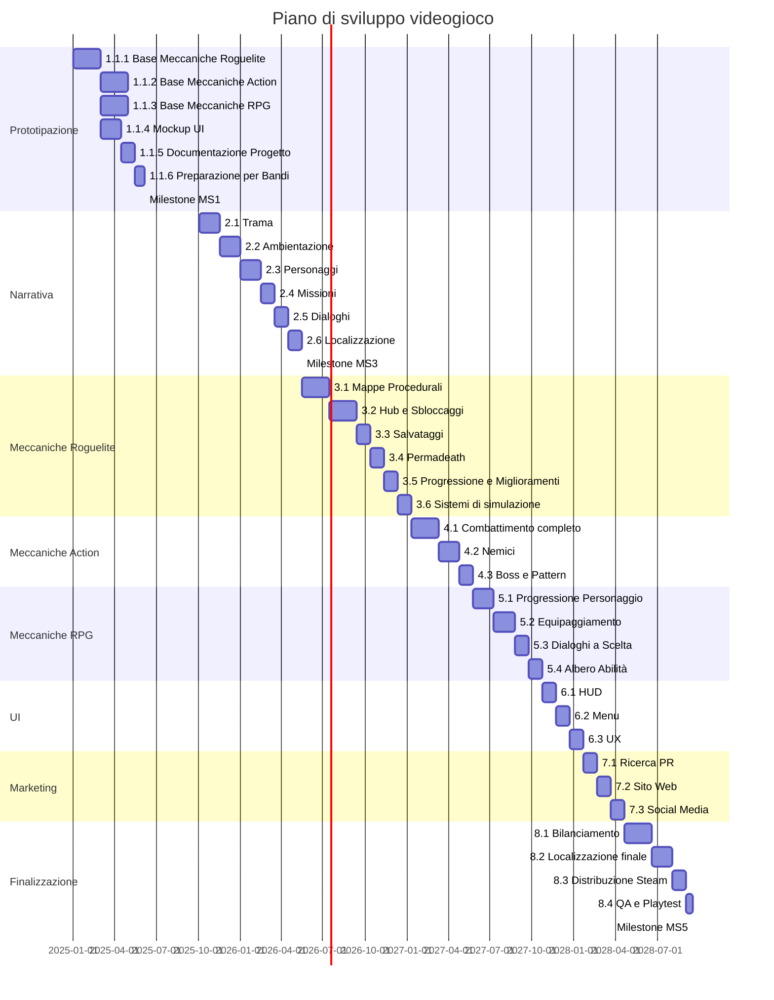
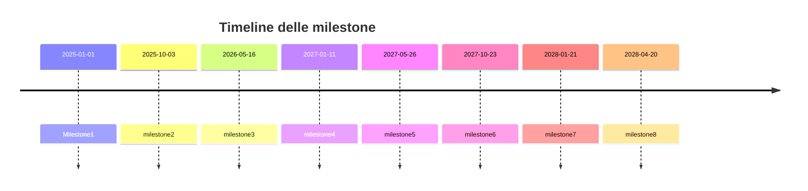

# Gantt

Di seguito è riportato il diagramma di Gantt per il progetto, che mostra le attività principali,
le loro dipendenze e le tempistiche previste per ciascuna fase dello sviluppo del videogioco.
Le attività sono suddivise in sezioni tematiche e sono indicate le milestone principali.

Di seguito sono riportate le milestone principali del progetto:

| Fase                  | Inizio      | Fine        | Durata (giorni) | Durata (mesi) |
|-----------------------|-------------|-------------|-----------------|---------------|
| **1. Prototipazione** | 1 Gen 2025  | 3 Ott 2025  | 275             | 9.2           |
| **2. Narrativa**      | 3 Ott 2025  | 16 Mag 2026 | 225             | 7.5           |
| **3. Roguelite**      | 16 Mag 2026 | 11 Gen 2027 | 240             | 8.0           |
| **4. Action**         | 11 Gen 2027 | 26 Mag 2027 | 135             | 4.5           |
| **5. RPG**            | 26 Mag 2027 | 23 Ott 2027 | 150             | 5.0           |
| **6. UI**             | 23 Ott 2027 | 21 Gen 2028 | 90              | 3.0           |
| **7. Marketing**      | 21 Gen 2028 | 20 Apr 2028 | 90              | 3.0           |
| **8. Finalizzazione** | 20 Apr 2028 | 17 Set 2028 | 150             | 5.0           |
