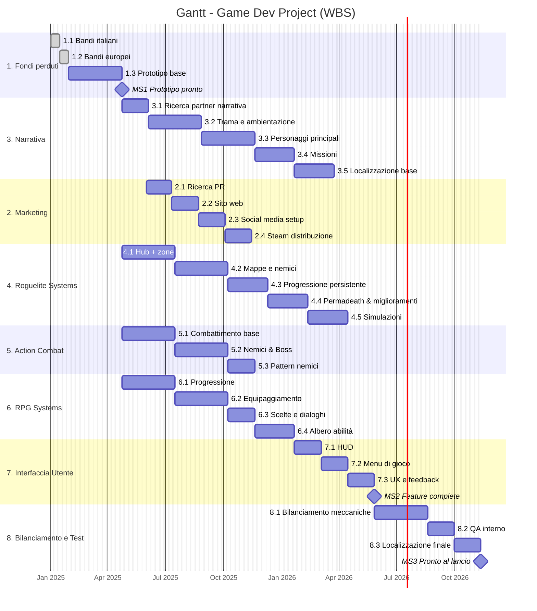

```mermaid
gantt
    title Gantt - Game Dev Project (WBS)
    dateFormat  YYYY-MM-DD
    axisFormat  %b %Y
    excludes    weekends

%% Fase 1 - Prototipo per fondi perduti
    section 1. Fondi perduti
        1.1 Bandi italiani              :done, t1_1, 2025-01-01, 10d
        1.2 Bandi europei               :done, t1_2, after t1_1, 10d
        1.3 Prototipo base              :t1_3, after t1_2, 60d
        MS1 Prototipo pronto            :milestone, ms1, after t1_3, 0d

    %% Fase 2 - Narrativa
    section 3. Narrativa
        3.1 Ricerca partner narrativa   :t3_1, after ms1, 30d
        3.2 Trama e ambientazione       :t3_2, after t3_1, 60d
        3.3 Personaggi principali       :t3_3, after t3_2, 60d
        3.4 Missioni                    :t3_4, after t3_3, 45d
        3.5 Localizzazione base         :t3_5, after t3_4, 45d

    %% Fase 3 - Marketing
    section 2. Marketing
        2.1 Ricerca PR                  :t2_1, 2025-06-01, 30d
        2.2 Sito web                    :t2_2, after t2_1, 30d
        2.3 Social media setup          :t2_3, after t2_2, 30d
        2.4 Steam distribuzione         :t2_4, after t2_3, 30d

    %% Fase 4 - Gameplay Systems
    section 4. Roguelite Systems
        4.1 Hub + zone                  :t4_1, after ms1, 60d
        4.2 Mappe e nemici              :t4_2, after t4_1, 60d
        4.3 Progressione persistente    :t4_3, after t4_2, 45d
        4.4 Permadeath & miglioramenti  :t4_4, after t4_3, 45d
        4.5 Simulazioni                 :t4_5, after t4_4, 45d

    %% Fase 5 - Meccaniche Action
    section 5. Action Combat
        5.1 Combattimento base          :t5_1, after ms1, 60d
        5.2 Nemici & Boss               :t5_2, after t5_1, 60d
        5.3 Pattern nemici              :t5_3, after t5_2, 30d

    %% Fase 6 - Meccaniche RPG
    section 6. RPG Systems
        6.1 Progressione                :t6_1, after ms1, 60d
        6.2 Equipaggiamento             :t6_2, after t6_1, 60d
        6.3 Scelte e dialoghi           :t6_3, after t6_2, 30d
        6.4 Albero abilità              :t6_4, after t6_3, 45d

    %% Fase 7 - UI/UX
    section 7. Interfaccia Utente
        7.1 HUD                         :t7_1, after t6_4, 30d
        7.2 Menu di gioco               :t7_2, after t7_1, 30d
        7.3 UX e feedback               :t7_3, after t7_2, 30d
        MS2 Feature complete            :milestone, ms2, after t7_3, 0d

    %% Fase 8 - Bilanciamento e QA
    section 8. Bilanciamento e Test
        8.1 Bilanciamento meccaniche    :t8_1, after ms2, 60d
        8.2 QA interno                  :t8_2, after t8_1, 30d
        8.3 Localizzazione finale       :t8_3, after t8_2, 30d
        MS3 Pronto al lancio            :milestone, ms3, after t8_3, 0d


```