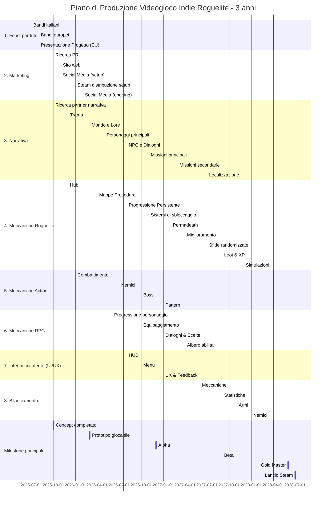

```mermaid
gantt
title Piano di Produzione Videogioco Indie Roguelite - 3 anni
dateFormat  YYYY-MM
section 1. Fondi perduti
Bandi italiani                :done, bandi_it,     2025-07, 3m
Bandi europei                :active, bandi_eu,     2025-08, 4m
Presentazione Progetto (EU) :bandi_eu_present,     after bandi_eu, 1m

    section 2. Marketing
    Ricerca PR                   :pr_search,           2025-10, 2m
    Sito web                     :website,             2025-11, 2m
    Social Media (setup)        :social_start,        2025-11, 3m
    Steam distribuzione setup   :steam_setup,         2026-01, 2m
    Social Media (ongoing)      :social_ongoing,      2026-02, 30m

    section 3. Narrativa
    Ricerca partner narrativa   :narr_partner,        2025-10, 2m
    Trama                       :story,               2025-12, 4m
    Mondo e Lore                :lore,                2026-03, 4m
    Personaggi principali       :characters_main,     2026-05, 3m
    NPC e Dialoghi              :npc_dialogues,       2026-08, 4m
    Missioni principali         :missions_main,       2026-11, 4m
    Missioni secondarie         :missions_side,       2027-03, 4m
    Localizzazione              :localization,        2027-07, 4m

    section 4. Meccaniche Roguelite
    Hub                         :hub,                 2025-12, 4m
    Mappe Procedurali           :procedural_maps,     2026-04, 4m
    Progressione Persistente    :persistent_prog,     2026-08, 3m
    Sistemi di sbloccaggio      :unlock_systems,      2026-11, 3m
    Permadeath                  :permadeath,          2027-02, 2m
    Miglioramento               :upgrade_systems,     2027-04, 3m
    Sfide randomizzate          :random_challenges,   2027-07, 2m
    Loot & XP                   :loot_xp,             2027-09, 3m
    Simulazioni                 :simulations,         2027-12, 3m

    section 5. Meccaniche Action
    Combattimento               :combat,              2026-01, 6m
    Nemici                      :enemies,             2026-07, 3m
    Boss                        :bosses,              2026-10, 3m
    Pattern                     :combat_patterns,     2027-01, 3m

    section 6. Meccaniche RPG
    Progressione personaggio    :rpg_progress,        2026-06, 4m
    Equipaggiamento             :equipment,           2026-10, 3m
    Dialoghi & Scelte           :dialogue_choices,    2027-01, 3m
    Albero abilità              :skill_tree,          2027-04, 3m

    section 7. Interfaccia utente (UI/UX)
    HUD                         :hud,                 2026-08, 2m
    Menu                        :menu,                2026-10, 2m
    UX & Feedback               :ux_feedback,         2027-01, 3m

    section 8. Bilanciamento
    Meccaniche                  :balance_mechanics,   2027-06, 3m
    Statistiche                 :balance_stats,       2027-09, 2m
    Armi                        :balance_weapons,     2027-11, 2m
    Nemici                      :balance_enemies,     2028-01, 2m

    section Milestone principali
    Concept completato          :milestone_concept,   2025-10, 1d
    Prototipo giocabile         :milestone_proto,     2026-03, 1d
    Alpha                       :milestone_alpha,     2026-12, 1d
    Beta                        :milestone_beta,      2027-09, 1d
    Gold Master                 :milestone_gold,      2028-06, 1d
    Lancio Steam                :milestone_launch,    2028-07, 1d

```