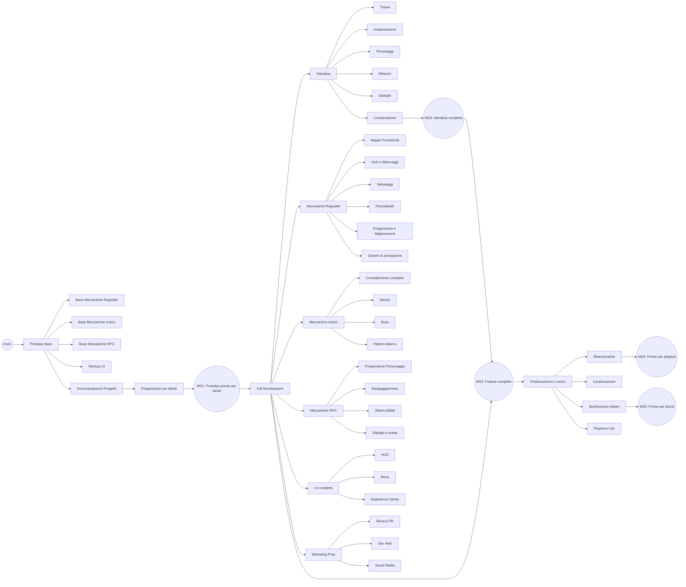

# Project network diagram

```mermaid
graph LR

%% === FASE 1: PROTOTIPO PER BANDI ===
    START((Inizio))
    PROT[Prototipo Base]
    PROT_Roguelite[Base Meccaniche Roguelite]
    PROT_Action[Base Meccaniche Action]
    PROT_RPG[Base Meccaniche RPG]
    PROT_UI[Mockup UI]
    PROT_DOC[Documentazione Progetto]
    PROT_PRESENT[Preparazione per Bandi]
    MS1((MS1: Prototipo pronto per bandi))
    START --> PROT
    PROT --> PROT_Roguelite
    PROT --> PROT_Action
    PROT --> PROT_RPG
    PROT --> PROT_UI
    PROT --> PROT_DOC
    PROT_DOC --> PROT_PRESENT --> MS1
%% === FASE 2: SVILUPPO COMPLETO ===
    DEV[Full Development]
    DEV --> NARR[Narrativa]
    DEV --> ROG[Meccaniche Roguelite]
    DEV --> ACT[Meccaniche Action]
    DEV --> RPG[Meccaniche RPG]
    DEV --> UI[UI completa]
    DEV --> MK[Marketing Prep]
    NARR --> NARR_TRAMA[Trama]
    NARR --> NARR_AMB[Ambientazione]
    NARR --> NARR_PG[Personaggi]
    NARR --> NARR_MISS[Missioni]
    NARR --> NARR_DLG[Dialoghi]
    NARR --> NARR_LOC[Localizzazione]
    NARR_LOC --> MS3((MS3: Narrativa completa))
    ROG --> ROG_MAP[Mappe Procedurali]
    ROG --> ROG_HUB[Hub e Sbloccaggi]
    ROG --> ROG_SAVE[Salvataggi]
    ROG --> ROG_PERMA[Permadeath]
    ROG --> ROG_UPGR[Progressione e Miglioramenti]
    ROG --> ROG_SIM[Sistemi di simulazione]
    ACT --> ACT_COMBAT[Combattimento completo]
    ACT --> ACT_NEMICI[Nemici]
    ACT --> ACT_BOSS[Boss]
    ACT --> ACT_PATTERN[Pattern Attacco]
    RPG --> RPG_PROG[Progressione Personaggio]
    RPG --> RPG_EQ[Equipaggiamento]
    RPG --> RPG_SKILL[Albero Abilità]
    RPG --> RPG_SCELTE[Dialoghi a scelta]
    UI --> UI_HUD[HUD]
    UI --> UI_MENU[Menu]
    UI --> UI_UX[Esperienza Utente]
    MK --> MK_PR[Ricerca PR]
    MK --> MK_SITO[Sito Web]
    MK --> MK_SOC[Social Media]
    DEV --> MS2((MS2: Feature complete))
%% === FASE 3: FINALIZZAZIONE ===
    FINAL[Finalizzazione e Lancio]
    FINAL --> BAL[Bilanciamento]
    FINAL --> LOC[Localizzazione]
    FINAL --> DIST[Distribuzione-Steam]
    FINAL --> TEST[Playtest e QA]
    BAL --> MS4((MS4: Pronto per playtest))
    DIST --> MS5((MS5: Pronto per lancio))
    MS1 --> DEV
    MS3 --> MS2
    MS2 --> FINAL


```