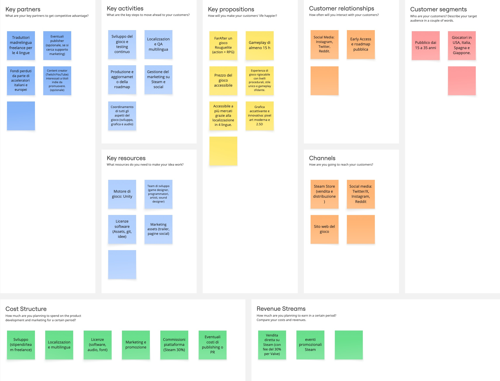

# 2-Meeting

## Context & Introduction

Nel secondo meeting sono emerse con chiarezza le motivazioni e le
opportunità alla base del progetto, definendone formalmente finalità e obiettivi
principali.

## Scopo del meeting

Il meeting aveva l’obiettivo di chiarire e condividere lo scopo del progetto,
supportato da un’attenta analisi del mercato videoludico, culminando nella
formalizzazione del POS (Project Overview Statement) e dei relativi allegati a
supporto delle decisioni prese.
È stato inoltre approfondito il modello di business del gioco, presentandone le
componenti chiave attraverso un Business Model Canvas.

## Partecipanti

Per migliorare la qualità e l'efficacia del meeting, si sono aggiunte alcune
figure chiave al team, selezionate in base alle loro competenze.

| Nome                 | Competenze                                  | Ruolo                         |
|----------------------|---------------------------------------------|-------------------------------|
| **Manuel Buizo**     | CEO, Project Manager, Software architecture | Project Manager e Facilitator |
| **Luana Mennuti**    | Game Designer, 3D artist, UI/UX Design      | Core Team                     |
| **Alessandro Ricci** | CTO, Technical Artist                       | Core Team                     |
| **Matteo Manicone**  | CFO, Marketing Manager                      | Core Team                     |
| **Sabatino Panella** | 2D, Character e Environment Artist          | Core Team                     |
| **Dominic Sambucco** | Sound Designer e Musicista                  | Core Team                     |

## Market Analysis

L'analisi di mercato ha messo in luce le tendenze dal 2015 al 2024, prendendo
in esame costo e durata dello sviluppo, longevità del gameplay, ricavi dalle
vendite, tipologie di prodotto (AAA, AA, A) e piattaforme di distribuzione.
Per ciascuna categoria sono stati riportati esempi concreti di titoli
rappresentativi, al fine di offrire una visione chiara delle dinamiche del
settore e delle opportunità disponibili.

[Market Analysis](Market-Analysis.md)

A seguito dell'analisi, sono stati identificati i seguenti punti chiave:

- **Costo di sviluppo**: 50K - 5M
- **Prezzo di vendita**: 15 - 25
- **Genere di gioco**: Rogue-like, Rogue-lite, Action, RPG
- **Categoria di prodotto**: Indie, AA
- **Durata dello sviluppo**: 2-3 anni
- **Durata del gameplay**: 15-30 ore
- **Piattaforme di distribuzione**: PC, console (PlayStation, Xbox, Nintendo Switch)
- **Target di mercato**: 15-35 anni
- **Localizzazione del gioco**: Nord America, Europa, Giappone, Corea, Sud America

## POS

Di seguito sono riportati i punti chiave del POS, che forniscono una panoramica
del progetto e delle sue caratteristiche principali:[POS](POS.md).

Assieme ai vari allegati utili a valutare e validare le decisioni prese:
- [Risk Analysis](Risk-Analysis.md)
- [Feasibility studies](Feasibility-studies.md)

## Business Model

In fine si riporta il Business Model Canvas del gioco, che illustra le
componenti principali del modello di business:

