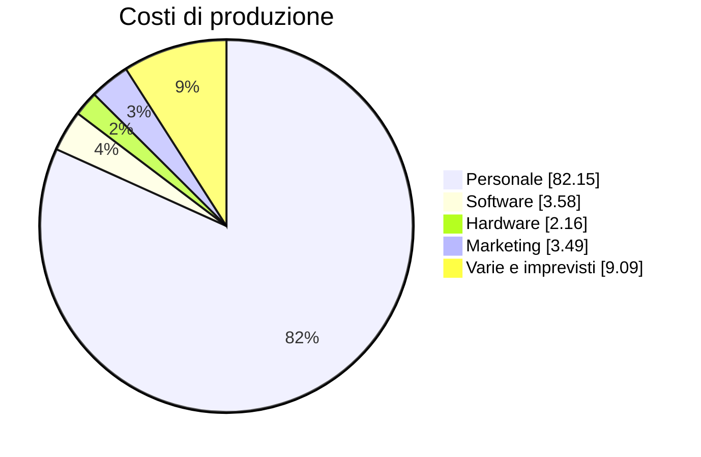
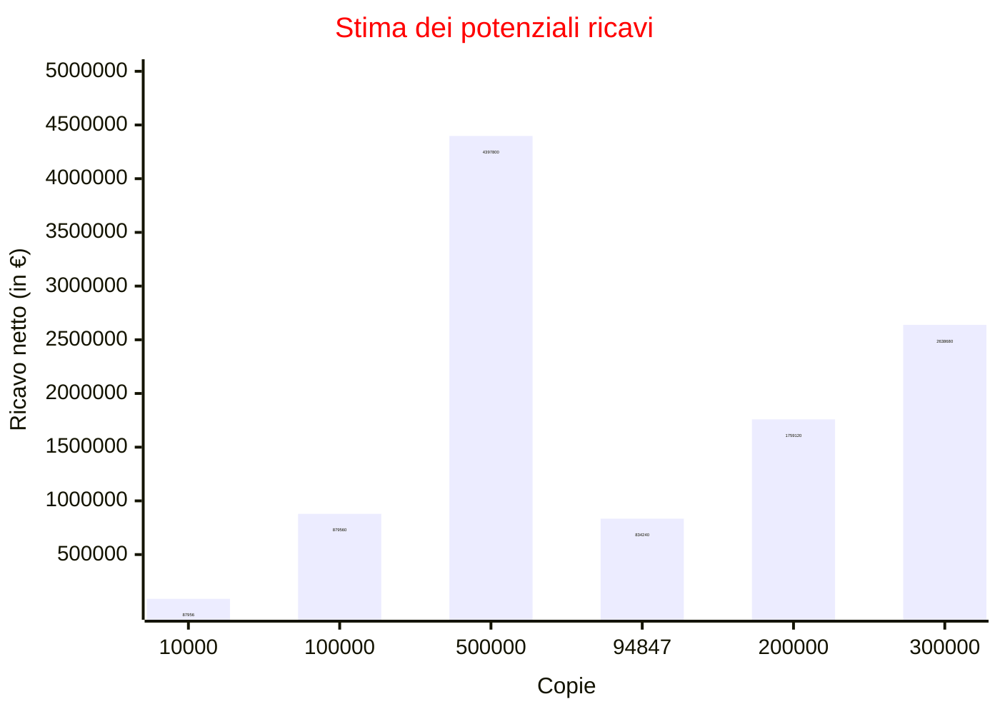

# Feasibility studies

Sono stati analizzati i costi e i benefici del progetto, per valutare la sua
sostenibilità economica e il potenziale ritorno sugli investimenti.

## Informazioni generali

- **Titolo provvisorio**: FarAfter
- **Genere / Stile di gioco**: Rogue-lite (Action + RPG)
- **Durata stimata del progetto**: 3 anni

### Team coinvolto (ruoli e numero)

Core team di 6 persone, con competenze in project management, game design,
programmazione, arte 2D/3D, sound design e marketing.

| Nome                 | Ruolo                                                       |
|----------------------|-------------------------------------------------------------|
| **Manuel Buizo**     | CEO, Project Manager, Software architecture e Programmatore |
| **Luana Mennuti**    | Game Designer, 3D artist, UI/UX Design e Programmatore      |
| **Alessandro Ricci** | CTO e Technical Artist                                      |
| **Sabatino Panella** | 2D, Character e Environment Artist                          |
| **Matteo Manicone**  | CFO e Marketing Manager                                     |
| **Dominic Sambucco** | Sound Designer e Musicista                                  |

Collaboratori:

| Nome                     | Ruolo                        |
|--------------------------|------------------------------|
| **Lewis Edward Cross**   | Animator e Motion Designer   |
| **Vittoria Pompolani**   | Illustrator e Concept Artist |
| **Alessandro la monica** | Concept Artist               |

## Cost/benefit analysis

**Costi totali**: € 834.240

### Costi di sviluppo

**Totale sviluppo**: € 805.090

| Voce                         | Costo stimato | Note                                              |
|------------------------------|---------------|---------------------------------------------------|
| **Stipendi team core**       | € 648.000     | €3.000/mese/persona                               |
| **Freelance artisti**        | € 54.000      | Progetto parziale (1 anno)                        |
| **Licenze software**         | € 5.000       | Include asset tool e IDE                          |
| **Asset & plugin**           | € 6.000       | Su Unity Asset Store e simili                     |
| **GitHub (Teams + Actions)** | € 900         | €25/mese per 3 anni                               |
| **Hardware e upgrade**       | € 18.000      | Sostituzioni totale                               |
| **CI e testing automatico**  | € 0           | Incluso in GitHub Actions (fino a 2.000 min/mese) |
| **Varie e imprevisti (10%)** | € 73.190      | Calcolato sul subtotale sviluppo                  |

### Costi di marketing e pubblicazione

**Totale marketing**: € 29.150

| Voce                            | Costo stimato        | Note                             |
|---------------------------------|----------------------|----------------------------------|
| Sito, dominio, email            | € 500                | Branding base                    |
| Trailer professionale           | € 4.000              | Reveal e launch                  |
| Grafica marketing / cover store | € 2.000              | illustrazioni, assets            |
| Campagne ADV (meta/steam ads)   | € 10.000             | 3 fasi: reveal, wishlist, lancio |
| Localizzazione (5 lingue)       | € 10.000             | ITA, ENG, JAP, SPA               |
| Commissioni store (Steam 30%)   | Incluso sotto ricavi | Non anticipati                   |
| **Varie e imprevisti (10%)**    | € 2.650              | Calcolato sul subtotale          |

### Stima dei ricavi potenziali

- **Prezzo di vendita**: € 19,99
- **Commissioni store (Steam)**: 30%
- **Tasse Italiane**: 26%
- **Ricavo vendita**: € 13,99
- **Ricavo netto**: € 8,80
- **Breakeven**: 94.097 copie
- **Ritorno sull'investimento ottimo**: 300.000 copie

| Voce           | Copie   | Ricavo lordo | Ricavo netto | Ritorno sull'investimento | ROI     |
|----------------|---------|--------------|--------------|---------------------------|---------|
| Vendite minime | 10.000  | € 199.900    | € 87.956     | -€ 746.284                | 10,63%  |
| Vendite medie  | 100.000 | € 1.999.000  | € 879.560    | € 45.320                  | 105,43% |
| Vendite ottime | 500.000 | € 9.995.000  | € 4.397.800  | € 3.563.560               | 527,16% |
| Breakeven      | 94.847  | € 1.896.000  | € 834.240    | € 0,00                    | 100,00% |
| ritorno medio  | 200.000 | € 3.998.000  | € 1.759.120  | € 924.880                 | 210,86% |
| ritorno ottimo | 300.000 | € 5.997.000  | € 2.638.680  | € 2.638.680               | 316,30% |

## Return on investment

Per il calcolo del ritorno sull'investimento ottimo, si è considerato un period o di 1 anni
dopo il lancio, con un picco di vendite nei primi 6 mesi e un calo graduale.

Si sono prese in considerazione per avere un vantaggio e una prospettiva di crescita:

- Tasse per il mantenimento dell'azienda
- Investimento per un prossimo progetto
- Sviluppo sullo stesso titolo: DLC, merchandising, ecc.
- Nuove possibilità di espansione del azienda
- Diversificazione del portafoglio prodotti: sviluppo di altri giochi

## Calcoli effettuati su excel

<iframe src="https://docs.google.com/spreadsheets/d/1VJKu_P6mUfhXTyA3cvgl_bDoUeMmOLCSJxWIu0laI_U/edit?usp=sharing"
width="100%" height="400px" frameborder="0"></iframe>

## Potential investors

Sono stati identificati diversi potenziali investitori, sia in ambito
italiano che europeo, interessati a sostenere la nascita di nuove realtà
videoludiche attraverso finanziamenti a fondo perduto.
Sono inoltre stati analizzati alcuni publisher in linea con le caratteristiche
del progetto — un rogue-lite con grafica in pixel art moderna — che potrebbero
essere interessati non solo alla pubblicazione del gioco, ma anche a supportarlo
con risorse economiche, visibilità e attività di marketing.

### Tabella Acceleratori Italiani per Videogiochi

| Nome Acceleratore           | Finanziamento (€)               | Località            | Tipo Supporto                        | Durata programma  | Note Speciali                                |
|-----------------------------|---------------------------------|---------------------|--------------------------------------|-------------------|----------------------------------------------|
| **Bologna Game Farm**       | 30.000Sviluppo€ a fondo perduto | Bologna             | Mentoring + uffici + consulenze      | 4 mesi            | Focus su team emergenti con prototipo        |
| **Quickload**               | 60.000Sviluppo€ + mentoring     | Torino              | Equity-free, partner con 34BigThings | \~5 mesi          | Accesso publisher e dev esperti              |
| **Cinecittà Game Hub**      | \~30.000Sviluppo€ (variabile)   | Roma (Cinecittà)    | Postazione + mentoring + visibilità  | \~6 mesi          | Supportato da IIDEA e Regione Lazio          |
| **Creative Europe – Media** | Fino a 150.000–200.000Sviluppo€ | UE (Italia inclusa) | Grant europeo a fondo perduto        | \~1 anno          | Competitivo, per prototipi con potenziale EU |
| **Red Bull Indie Forge**    | Visibilità + premi (non cash)   | Online/Italia       | Evento/showcase + partner media      | Selezione annuale | Ottimo per visibilità e network, non fondi   |

### Publisher per Giochi Indie – RogueLite & Pixel Art

| Nome Publisher       | Giochi Rilevanti Pubblicati                       | Marketing/Distribuzione                      | Percentuale Guadagno stimata\* | Note Chiave                                                      |
|----------------------|---------------------------------------------------|----------------------------------------------|--------------------------------|------------------------------------------------------------------|
| **Devolver Digital** | *Enter the Gungeon*, *Loop Hero*, *Katana ZERO*   | Alta – E3, showcase, trailer virali          | 30–50%                         | Molto selettivi, ma spingono forte i titoli con personalità      |
| **Chucklefish**      | *Stardew Valley* (early), *Eastward*, *Wargroove* | Media/Alta – molto amati dalla community     | 30–40%                         | Famosi per curare giochi in pixel art con forte valore artistico |
| **Megabit (UK)**     | *Soulstone Survivors*, *Rogue AI Simulator*       | Media – community-driven, accesso influencer | 20–35%                         | Ottimo supporto su Steam, adatti a team giovani o 1° progetto    |
| **Raw Fury**         | *Sable*, *Kingdom*, *Dome Keeper*                 | Alta – branding molto forte                  | 30–50%                         | Amanti del pixel art e concept originali                         |
| **Team17**           | *Blasphemous*, *Greak*, *Neon Abyss*              | Alta – Steam, console, PR                    | 25–35%                         | Ottimo ponte per porting console, ma richiesta qualità elevata   |
| **Humble Games**     | *Unsighted*, *Moonscars*, *Archvale*              | Alta – bundle, store, console                | 20–35%                         | Molto presenti su bundle e abbonamenti                           |
| **TinyBuild**        | *Pathologic 2*, *Streets of Rogue*                | Alta su Steam, YouTube                       | 30–40%                         | Buon supporto marketing, ma gestione a volte rigida              |
| **No More Robots**   | *Descenders*, *Not Tonight*, *Heist Simulator*    | Media – community & console                  | 25–35%                         | Forte lato narrativo e idee fuori dagli schemi                   |

