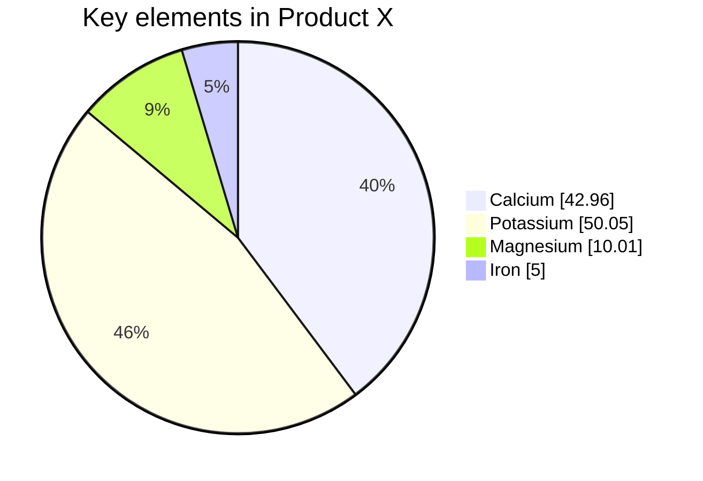
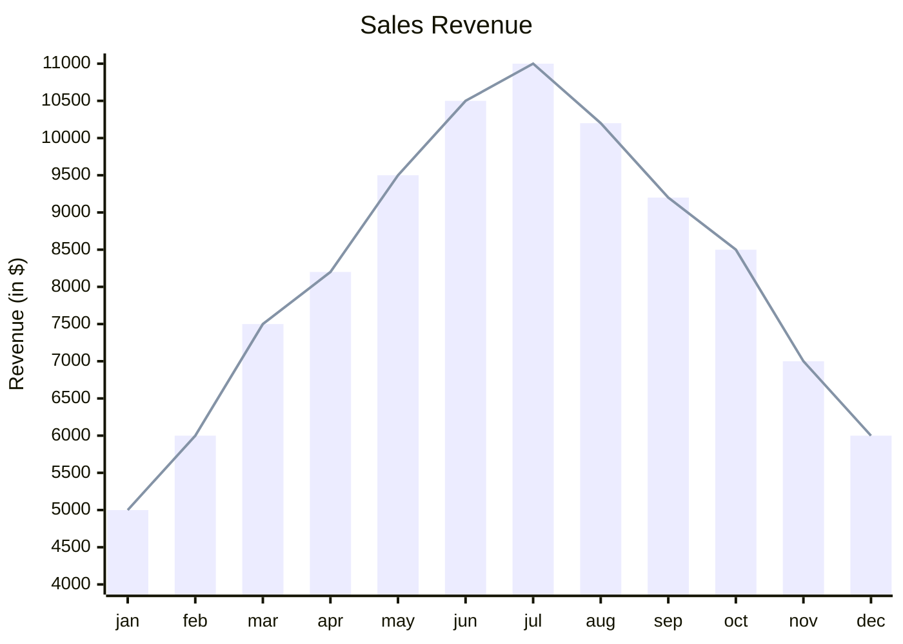

# Feasibility studies

Sono stati analizzati i costi e i benefici del progetto, per valutare la sua
sostenibilità economica e il potenziale ritorno sugli investimenti.

## Informazioni generali

- **Titolo provvisorio**: FarAfter
- **Genere / Stile di gioco**: Rogue-lite (Action + RPG)
- **Durata stimata del progetto**: 3 anni

### Team coinvolto (ruoli e numero)

Core team di 6 persone, con competenze in project management, game design,
programmazione, arte 2D/3D, sound design e marketing.

| Nome                 | Ruolo                                                       |
|----------------------|-------------------------------------------------------------|
| **Manuel Buizo**     | CEO, Project Manager, Software architecture e Programmatore |
| **Luana Mennuti**    | Game Designer, 3D artist, UI/UX Design e Programmatore      |
| **Alessandro Ricci** | CTO e Technical Artist                                      |
| **Sabatino Panella** | 2D, Character e Environment Artist                          |
| **Matteo Manicone**  | CFO e Marketing Manager                                     |
| **Dominic Sambucco** | Sound Designer e Musicista                                  |

Collaboratori:

| Nome                     | Ruolo                        |
|--------------------------|------------------------------|
| **Lewis Edward Cross**   | Animator e Motion Designer   |
| **Vittoria Pompolani**   | Illustrator e Concept Artist |
| **Alessandro la monica** | Concept Artist               |

## Cost/benefit analysis

**Costi totali**: € 827.640

### Costi di sviluppo

**Totale sviluppo**: € 805.090

| Voce                         | Costo stimato | Note                                              |
|------------------------------|---------------|---------------------------------------------------|
| **Stipendi team core**       | € 648.000     | €3.000/mese/persona                               |
| **Freelance artisti**        | € 54.000      | Progetto parziale (1 anno)                        |
| **Licenze software**         | € 5.000       | Include asset tool e IDE                          |
| **Asset & plugin**           | € 6.000       | Su Unity Asset Store e simili                     |
| **GitHub (Teams + Actions)** | € 900         | €25/mese per 3 anni                               |
| **Hardware e upgrade**       | € 18.000      | Sostituzioni totale                               |
| **CI e testing automatico**  | € 0           | Incluso in GitHub Actions (fino a 2.000 min/mese) |
| **Varie e imprevisti (10%)** | € 73.190      | Calcolato sul subtotale sviluppo                  |

### Costi di marketing e pubblicazione

**Totale marketing**: € 22.550

| Voce                            | Costo stimato        | Note                             |
|---------------------------------|----------------------|----------------------------------|
| Sito, dominio, email            | € 500                | Branding base                    |
| Trailer professionale           | € 4.000              | Reveal e launch                  |
| Grafica marketing / cover store | € 2.000              | illustrazioni, assets            |
| Campagne ADV (meta/steam ads)   | € 10.000             | 3 fasi: reveal, wishlist, lancio |
| Localizzazione (5 lingue)       | € 4.000              | ITA, ENG, JAP, SPA               |
| Commissioni store (Steam 30%)   | Incluso sotto ricavi | Non anticipati                   |
| **Varie e imprevisti (10%)**    | € 2.050              | Calcolato sul subtotale          |

### Stima dei ricavi potenziali

- **Prezzo di vendita**: € 19,99
- **Commissioni store (Steam)**: 30%
- **Tasse Italiane**: 26%
- **Ricavo vendita**: € 13,99
- **Ricavo netto**: € 8,80
- **Breakeven**: 94.097 copie
- **Ritorno sull'investimento ottimo**: 300.000 copie

| Voce           | Copie   | Ricavo netto | Ritorno sull'investimento | ROI     |
|----------------|---------|--------------|---------------------------|---------|
| Vendite minime | 10.000  | € 87.956     | € -739.684                | 10,63%  |
| Vendite medie  | 100.000 | € 879.560    | € 51.920                  | 106,27% |
| Vendite ottime | 500.000 | € 4.397.800  | € 3.570.160               | 531,37% |
| Breakeven      | 94.097  | € 827.640    | € 0,00                    | 100,00% |
| ritorno medio  | 200.000 | € 1.759.120  | € 931.480                 | 212,55% |
| ritorno ottimo | 300.000 | € 2.638.680  | € 1.811.040               | 318,82% |

## Return on investment

Per il calcolo del ritorno sull'investimento ottimo, si è considerato un period o di 1 anni
dopo il lancio, con un picco di vendite nei primi 6 mesi e un calo graduale.

Si sono prese in considerazione per avere un vantaggio e una prospettiva di crescita:

- Tasse per il mantenimento dell'azienda
- Investimento per un prossimo progetto
- Sviluppo sullo stesso titolo: DLC, merchandising, ecc.
- Nuove possibilità di espansione del azienda
- Diversificazione del portafoglio prodotti: sviluppo di altri giochi

## Calcoli effettuati su excel

<iframe src="https://docs.google.com/spreadsheets/d/1VJKu_P6mUfhXTyA3cvgl_bDoUeMmOLCSJxWIu0laI_U/edit?usp=sharing"
width="100%" height="400px" frameborder="0"></iframe>

## Potential investors

- faccio appena ho un pelo di tempo