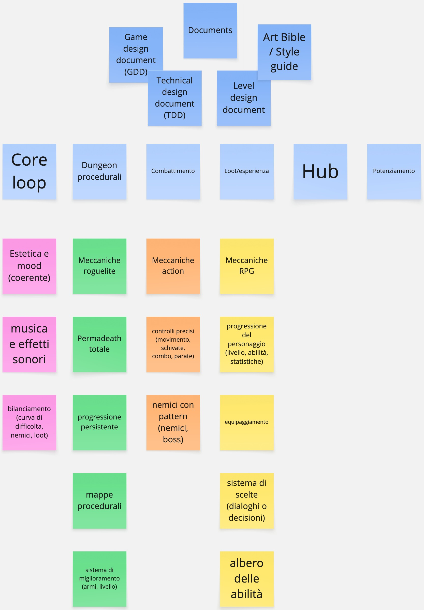

# RBS (Requirement Breakdown Structure)

1. Documentazione
    - Game Design Document (GDD)
        - Descrizione generale
        - Core loop
        - Gameplay dettagliato
        - Livelli progressione
        - UI/UX design
        - Stile visivo e sonoro
    - Technical Design Document (TDD)
        - Architettura del codice
        - Sistemi di testing
        - Sistemi di gioco principali
        - Tool interni e esterni
        - Middleware
    - Level Design Document
        - Struttura e tipologia delle stanze
        - Logica di generazione procedurale
        - Meccaniche dell'hub
        - Eventi casuali
        - Biomi
    - Art Bible e Stile Guide
        - Palette colori
        - Stile delle animazioni
        - UI e HUD coerente
2. Qualità non funzionale
    - Usabilità
        - interfaccia rapida: minimizzare il numero di clic
        - comandi standardizzati: mouse e tastiera, gamepad
    - Intuitività
        - grafica chiara e comprensibile
        - feedback visivo e sonoro
        - tutorial e guide in-game
    - Testabilità
        - sistemi di test automatizzati
        - CI/CD (Continuous Integration/Continuous Deployment)
        - Sistemi di simulazione
    - Prestazioni e ottimizzazione
        - frametime costante
3. Grafica
    - Pixel art moderna (grafica di riferimento: Eastworld, Hyper Light Drifter, Dead Cells)
    - Stile 2.5D(grafica di riferimento: Hades, Eastworld)
    - Animazioni fluide: 60 fps
    - Effetti visivi
        - Particle system
        - Effetti di luce e ombra
        - Effetti atmosferici
    - Interfaccia utente (UI)
        - HUD (Heads-Up Display)
            - elementi principali
        - Menu di gioco
            - Informazioni sul personaggio
            - Inventario
            - Impostazioni
    - User Experience (UX)
        - Navigazione intuitiva: minimizzare il numero di clic
        - Feedback visivo e sonoro
4. Audio
    - Musica originale
        - Tracce per tipologia di zone
    - Effetti sonori
    - Effetti ambientali
    - Voice over
        - Personaggi principali, NPC e nemici
5. Meccaniche roguelite
    - Sistema di permadeath
    - Progressione persistente
    - Sistema di miglioramento
    - Mappe procedurale
    - Sfide randomizzate
    - Sistemi di loot e esperienza
    - Sistemi di sbloccaggio: Hub
6. Meccaniche Action
    - Combattimento
    - Nemici
    - Boss
    - Pattern di combattimento
7. Meccaniche RPG
    - Progressione del personaggio
    - Equipaggiamento
    - Sistema di dialogo e scelta
    - Albero delle abilità
8. Bilanciamento
    - Meccaniche
    - Statistiche
    - Armi
    - Nemici
9. Narrativa
    - Ricerca partner
    - Trama
    - Personaggi
    - Ambientazione
    - Localizzazione
        - Ricerca di partner
        - Lingue: IT, ES, JP, ZH
10. Fondi perduti
    - Bandi italiani
    - Bandi europei
11. Pubblicazione
    - Ricerca di un PR
    - Social media: Instagram, Twitter, Reddit
    - Distribuzione tramite steam
    - Sito web

## Event Storming

È stato utilizzato l'**event storming** per identificare e chiarire i requisiti
del progetto, sia funzionali che non funzionali. Questo approccio ha permesso di
visualizzare le interazioni tra gli eventi del sistema e di definire in modo
chiaro le aspettative del progetto.

<iframe src="https://miro.com/app/board/uXjVJat9vbM=/"
width="100%" height="400px" frameborder="0"></iframe>

